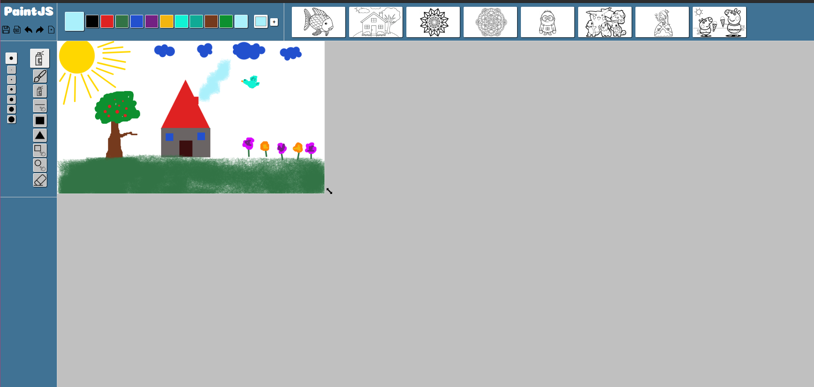
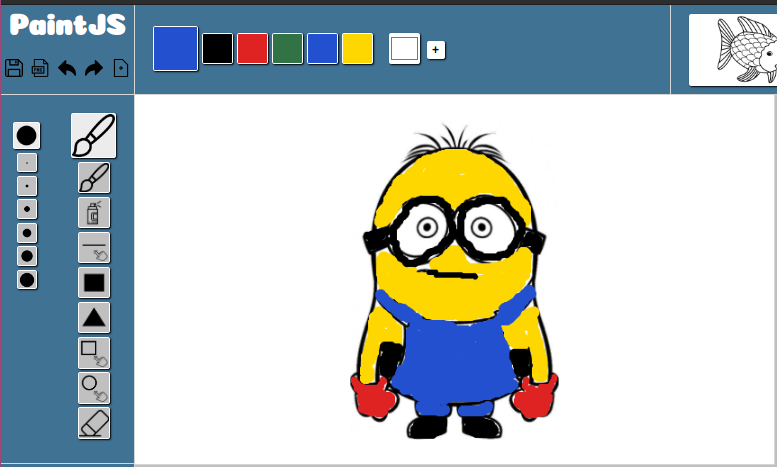
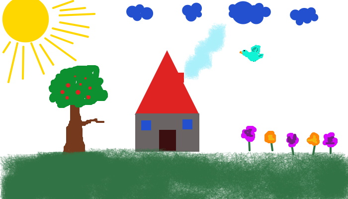

# PaintJS - for the creative mind

PaintJS is a tool to draw, doodle and color pages. 

It uses HTML Canvas, is written in Typescript and build with parcel-bundler.
 
 
---
 ### Available Gear
You can choose from: a paint brush, airbrush spraycan, a rectangle and a triangle.

Furthermore you can draw rectangles, circles and lines by dragging them in the desired shape/length/size.

If you've made a mistake do not worry, the last three actions are saved and can be undon. If by chance you then realize, the mistake wasn't one, you can redo this action.

---
### Colors and Templates
Beside the four given standard colors (red, green, blue, yellow) and the default color black, you can pick and create your own colors for the color pallet.

If you enjoy drawing and coloring in pages, but aint a picasso yourself, feel free to choose one of the provided coloring pages.

___
### Save and Share
The finished masterwork can be saved on your computer with or without a transparent background. Impress someone with your painting skills by sharing your piece of art 😉.

